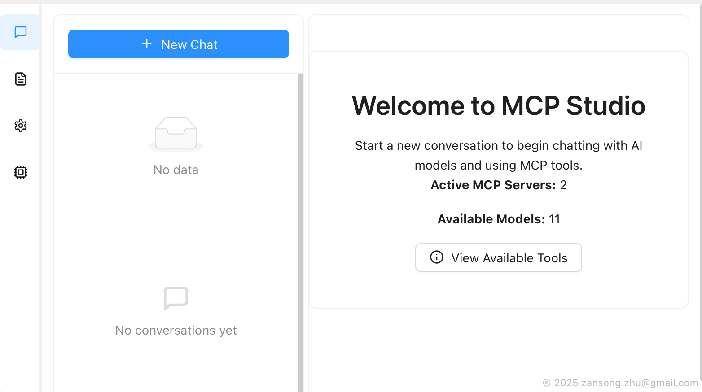
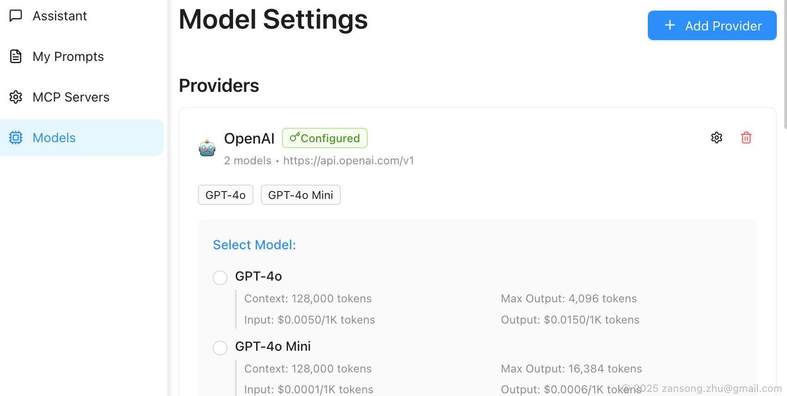
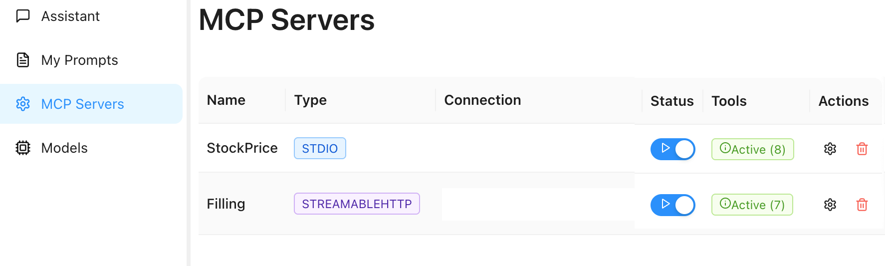
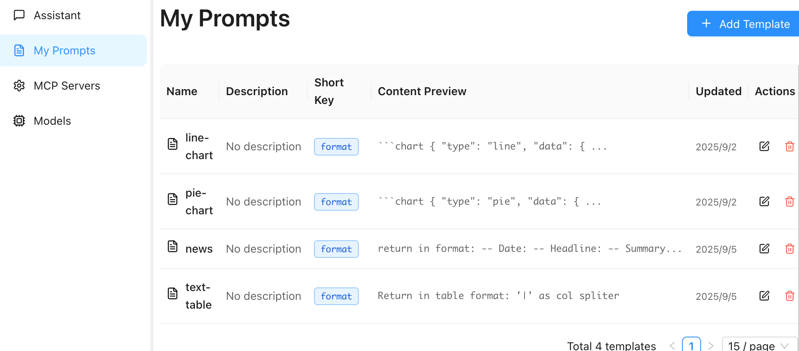
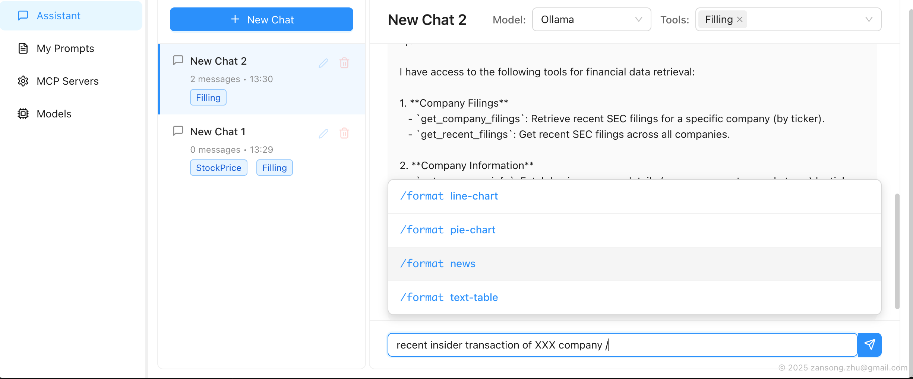

# MCP Studio



A minimal desktop application for working with Model Context Protocol (MCP) servers and AI assistants.

## Features

- 🤖 **AI Assistant**: Chat with AI models using a clean interface
- 🔧 **MCP Integration**: Connect to and manage MCP servers
- ⚙️ **Model Management**: Configure multiple AI providers and models
- 🖥️ **Desktop App**: Cross-platform Electron application

## Getting Started

### Prerequisites

- Node.js 22.x or higher
- npm or yarn

### Installation

1. Clone the repository:

```bash
git clone <repository-url>
cd mcp-studio
```

2. Install dependencies:

```bash
npm install
```

3. Start development:

```bash
npm run dev
```

### Building

Build for your current platform:

```bash
npm run build
```

Platform-specific builds:

```bash
npm run build:win    # Windows
npm run build:mac    # macOS
npm run build:linux  # Linux
```

## Configuration

### Adding LLM Providers



1. Go to the "Models" tab
2. Click "Add Provider"
3. Enter your provider details:
   - Name (e.g., "OpenAI", "Anthropic")
   - Base URL (e.g., "https://api.openai.com/v1")
   - API Key

### Adding MCP Servers



1. Go to the "MCP Servers" tab
2. Click "Add Server"
3. Configure your server:
   - **Stdio**: For command-line MCP servers
   - **SSE/HTTP**: For web-based MCP servers

#### Example Configurations

**File System Server (Stdio)**:

- Type: Stdio
- Command: `npx`
- Arguments: `@modelcontextprotocol/server-filesystem`

**Web Server (SSE)**:

- Type: SSE
- Base URL: `http://localhost:3000/sse`

### Setup Your Favorite Prompts



You can configure your favorite prompts and assign short keys to use them quickly during chat with LLMs:

1. Go to the "Prompt Templates" tab
2. Click "Add Template" 
3. Configure your prompt:
   - **Name**: Give your prompt a descriptive name
   - **Short Key**: Assign a quick shortcut (e.g., "code", "review", "debug")
   - **Template**: Write your prompt template with variables if needed

During chat, you can quickly access your favorite prompts by typing the short key, making your conversations with LLMs more efficient and consistent.

### Chat with Model/MCP Tools



Once you have configured your AI providers and MCP servers, you can start interactive conversations that leverage both AI models and MCP tools:

1. Go to the "Home" tab to access the chat interface
2. Select your preferred AI model from the configured providers and select your preferred MCP servers you want to use in this conversation
3. Start chatting - the AI can automatically use connected MCP tools to:
   - Access file systems and read/write files
   - Execute commands and scripts
   - Query databases and APIs
   - Perform web searches and data retrieval
   - And much more based on your connected MCP servers

The chat interface provides real-time tool execution feedback and maintains conversation history for seamless interactions.

**Helpful Tips:**
- Type "What available tools?" or key in `/tools` to show all tools available in this session
- Use your prompt templates in the message box by typing "/" followed by your template's short key

## Architecture

This application is built with:

- **Electron**: Desktop app framework
- **React**: UI framework
- **TypeScript**: Type safety
- **Ant Design**: UI components
- **Redux Toolkit**: State management
- **MCP SDK**: Model Context Protocol integration

## Project Structure

```
src/
├── main/           # Electron main process
│   └── services/   # Backend services (MCP, etc.)
├── renderer/       # React frontend
│   ├── pages/      # Application pages
│   ├── components/ # Reusable components
│   └── store/      # Redux store
├── preload/        # Electron preload scripts
└── shared/         # Shared types and utilities
```

## Contributing

1. Fork the repository
2. Create your feature branch
3. Make your changes
4. Test your changes
5. Submit a pull request

## License

MIT License

Copyright (c) 2025 MCP Studio